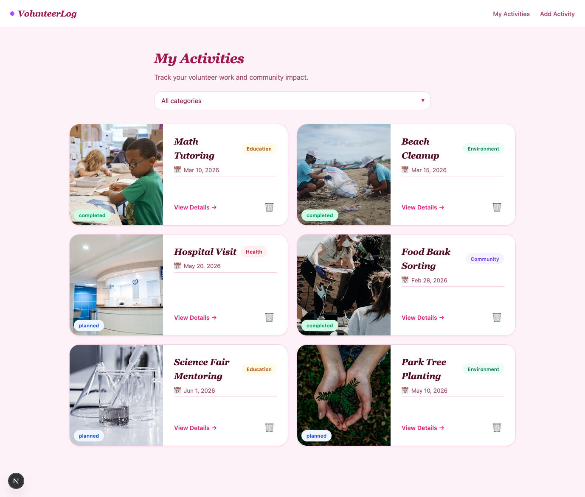
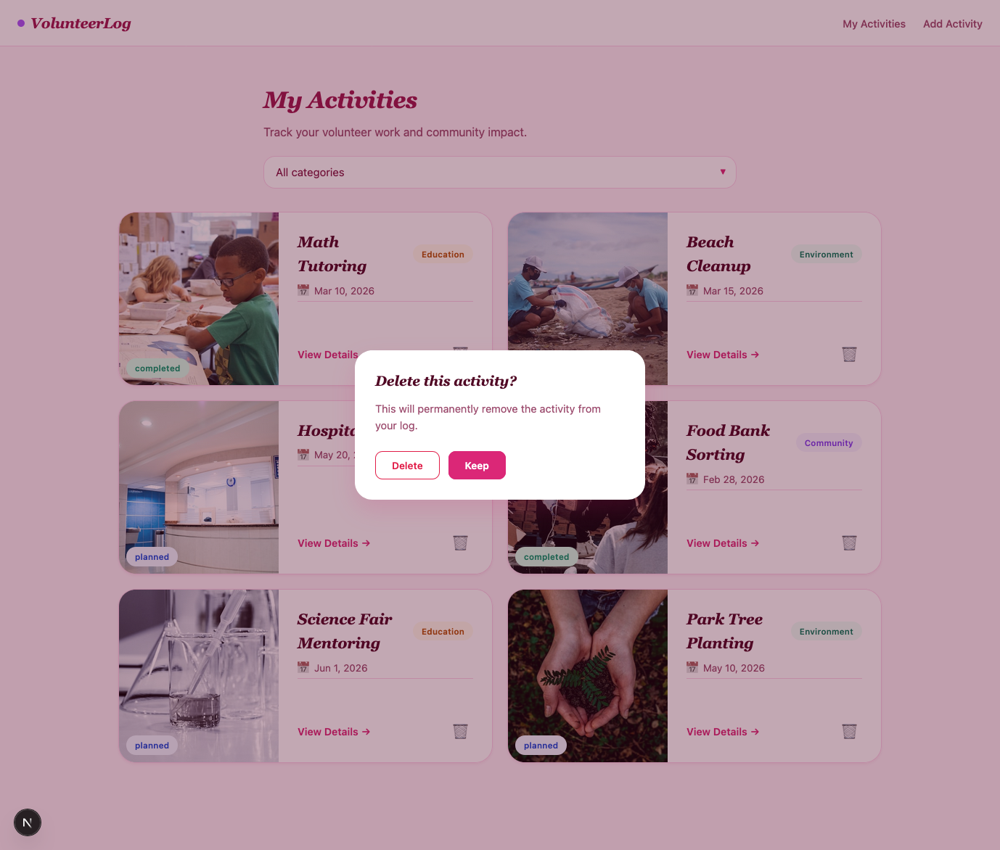
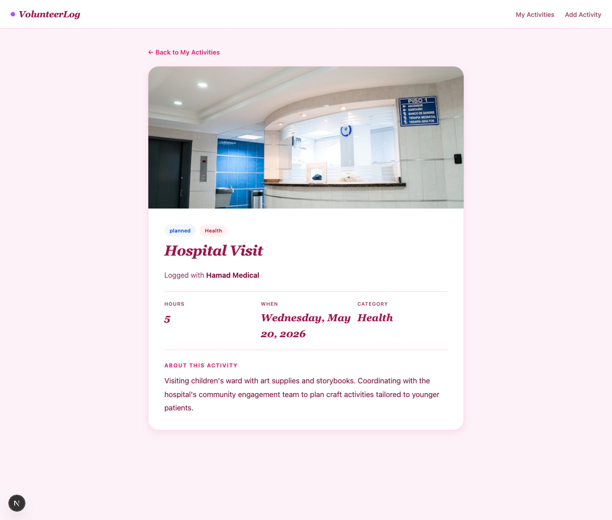
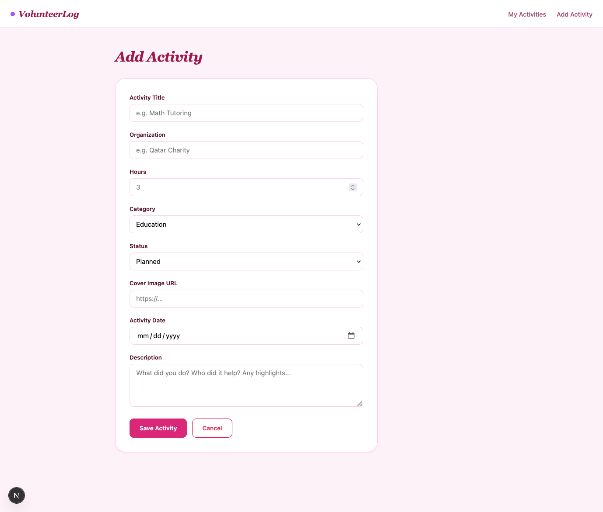

<p align="center">
<strong>Qatar University</strong><br>
College of Engineering - Department of Computer Science and Engineering<br>
<strong>CMPS 350 - Web Development</strong>
</p>

---

# Final Exam: Section B53 - VolunteerLog

**Duration:** 120 minutes
**Total Marks:** 110

---

## Exam Rules

1. Open-book, individual exam. Notes, lab code, and course materials are allowed.
2. **No AI tools.** No communication with other students.
3. AI use or sharing answers is an academic integrity breach: **zero grade** for the exam.

---

## What you will build

A small **Volunteer Activity Tracker**:

- **My Activities `/`**: category filter dropdown, gallery of activity cards, delete confirmation modal. (Adding an activity is reached via the "Add Activity" link in the NavBar.)
- **Activity Detail `/activities/[id]`**: full info for a single activity, including its description.
- **Form `/activities/form`**: add a new activity via a server action.

---

## What is given

```
volunteerlog-app/
├── app/
│   ├── components/ActivityCard.jsx ← TODO scaffold (hardcoded "Math Tutoring")
│   ├── components/ActivityForm.jsx ← TODO scaffold (hardcoded fields)
│   ├── activities/[id]/page.jsx    ← TODO scaffold (detail page)
│   ├── activities/form/page.jsx    ← thin wrapper, do not modify
│   ├── actions/activityActions.js  ← TODO scaffold
│   ├── page.js                     ← TODO scaffold (My Activities)
│   ├── globals.css                 ← all styling, do not modify
│   └── layout.js                   ← NavBar not wired yet
├── repos/ActivitiesRepo.js         ← do not modify
├── data/activities.json            ← seed data
└── public/client/                  ← vanilla JS reference
```

`ActivitiesRepo` includes `getAll`, `getById`, `create`, `update`, `delete`, plus:

- `filterByCategory(category)`: returns all activities if no category given, otherwise returns only activities with that exact category (e.g. `"Education"`).

---

## What you must create

| Deliverable                          | Purpose                                                           |
| ------------------------------------ | ----------------------------------------------------------------- |
| `app/api/activities/route.js`      | Returns activities, optionally filtered by `?filter=<category>` |
| `app/api/activities/[id]/route.js` | Returns one activity by id, or a 404                              |
| `app/components/NavBar.jsx`        | Top nav (brand, My Activities, Add Activity links)                |

The NavBar markup is in `public/client/js/app.js` (`navBarHTML()`); copy and convert `<a>` to Next.js `<Link>`.

---

## Data Structure

```json
{
    "id": 1,
    "title": "Math Tutoring",
    "organization": "QU Learning Center",
    "hours": 4,
    "category": "Education",
    "status": "completed",
    "date": "2026-03-10",
    "image": "https://images.unsplash.com/photo-1588072432836-e10032774350?w=600",
    "description": "Weekly one-on-one math tutoring for first-year students..."
}
```

**Categories:** Education, Health, Environment, Community. **Status:** planned, completed.

---

## TODO Breakdown

| TODO            | Points        | Description                         |
| --------------- | ------------- | ----------------------------------- |
| 1               | 25            | API routes                          |
| 2               | 10            | NavBar component                    |
| 3               | 25            | ActivityCard and My Activities page |
| 4               | 15            | Activity Detail page                |
| 5               | 35            | Server actions and form             |
| **Total** | **110** |                                     |

See `Testing-Grading-Sheet.md` for the per-check breakdown.

---

### TODO 1: API routes (25 pts)

Create the API folder from scratch. Use the repo's `filterByCategory` and `getById` methods.

- **`GET /api/activities`** -- returns all activities as JSON. When `?filter=<category>` is provided, returns only activities with that exact category.
- **`GET /api/activities/:id`** -- returns the matching activity, or a 404 with an error message.

---

### TODO 2: NavBar (10 pts)

Create `app/components/NavBar.jsx` from scratch. The markup is in `public/client/js/app.js` (`navBarHTML()`). Copy and convert `<a>` to `<Link>`.

Import and render the NavBar in `layout.js` so it shows on **every** page.

---

### TODO 3: My Activities (25 pts)





- **ActivityCard** (10 pts): replace hardcoded values with the `activity` prop (image, title, date, category + status badges). Wire the View Details link to navigate to the detail page (`/activities/<id>`) and wire the delete button. The detail page is what reveals organization, hours, and description - keep the card minimal.
- **Home page** (15 pts): wire the category dropdown, fetch from `/api/activities?filter=<category>`, render a card per activity, and show the delete confirmation modal.

---

### TODO 4: Activity Detail page (15 pts)



`app/activities/[id]/page.jsx` is a **server component**. `params.id` arrives from the URL.

- Fetch the activity with `activitiesRepo.getById(id)` server-side; call `notFound()` when the id does not exist.
- Format `activity.date` as a long-form string (weekday, month, day, year).
- Render the cover image, both badges (status + category), the activity title, the organization, a `<dl>` metadata block (Hours / When / Category), and the description (fall back to a placeholder when empty).
- Reuse the existing `.detail-*` classes from `globals.css` - do not invent new class names.

---

### TODO 5: Server actions and form (35 pts)



- **`createActivityAction`** -- read form data, convert hours to Number, validate `title`/`organization`/`hours > 0`, save via repo, revalidate and redirect.
- **`deleteActivityAction`** -- delete via repo and revalidate.
- **Form** -- wire `useActionState`, bind all fields including the new `description` textarea, show errors, disable button with "Saving..." while pending.

---

## Submission

Save and push to **your own repo** under `Final Exam/` before time ends.

```
Your Repo /
└── Final Exam/
    └── volunteerlog-app/
        ├── app/
        │   ├── api/activities/     ← you create
        │   ├── actions/
        │   ├── components/         ← your NavBar and ActivityCard
        │   ├── activities/
        │   └── page.js
        ├── data/
        ├── repos/
        └── public/
```

**Late pushes will not be accepted.** Good luck!
